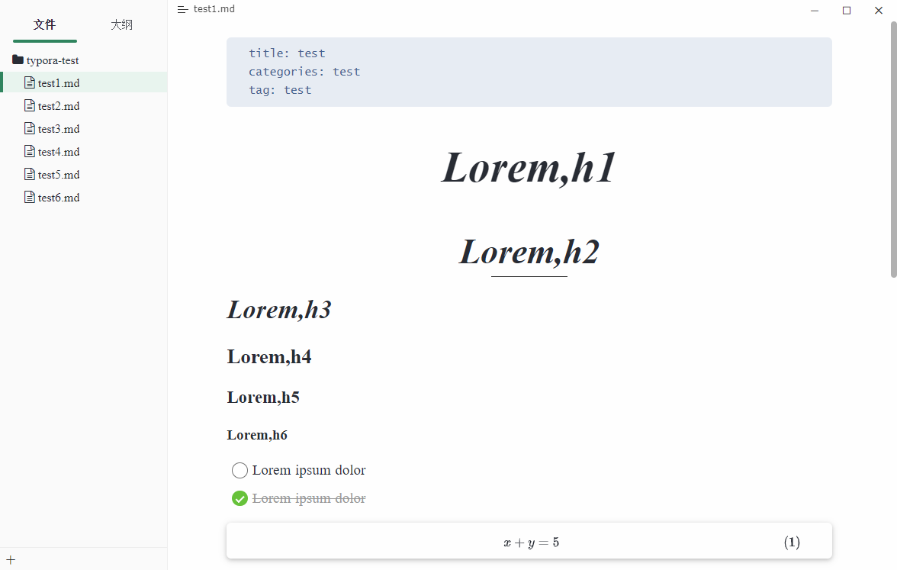
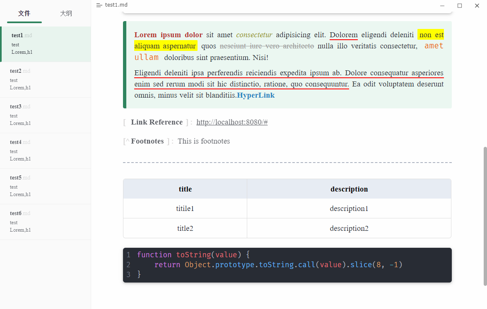
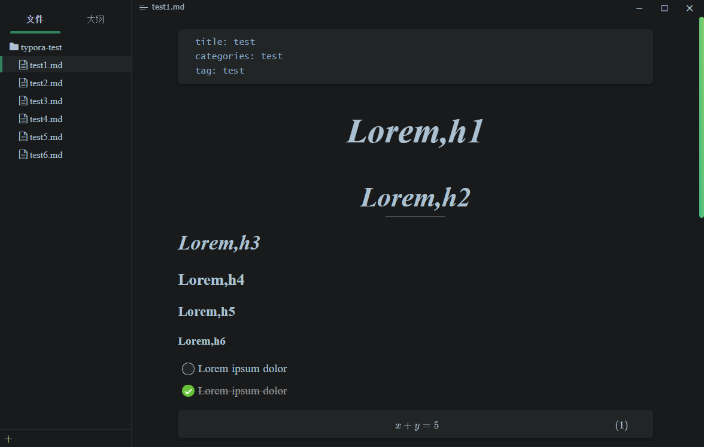
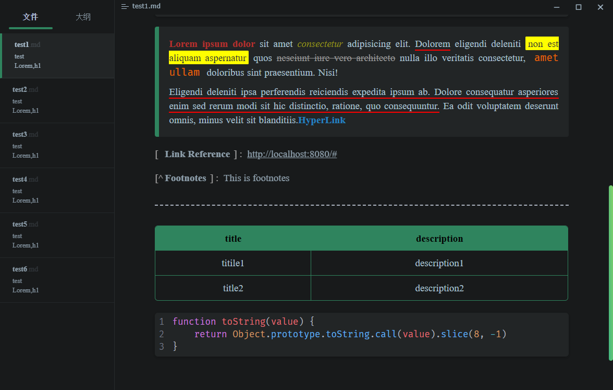

# Mo

The Mo theme references the styles of many other themes, while addressing many small details. You'll notice these little details as you go along.

**If you like the theme, use it.**

## Installation instructions

- Download the zipped project package.
- Copy the `mo.css` file and `mo-dark.css` file to your Typora theme library.
- Launch or restart Typora and choose `Mo`or`Mo Dark` from the theme menu.

## Screenshots

light:

dark:

## Notes

- Some small details on MacOS/Linux may differ from those on Windows

> This theme is written in SCSS. If you want to change the color of this theme, you can change `_variables.scss`file in the `src/utils/dark`or`src/utils/light`directory. Then compile the `mo.scss` or `mo-dark.scss` files.